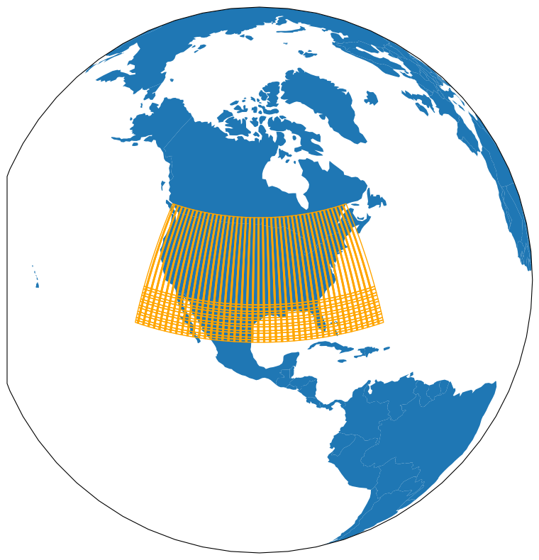
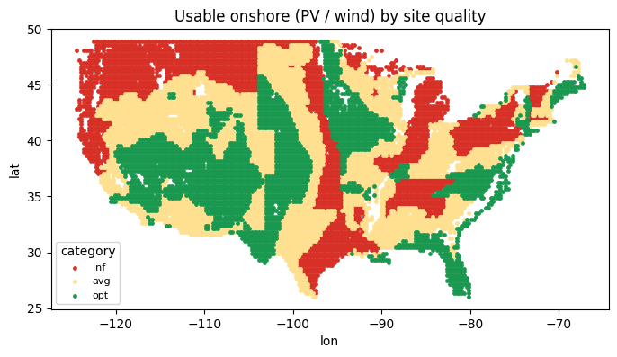
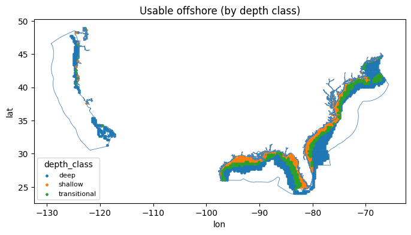
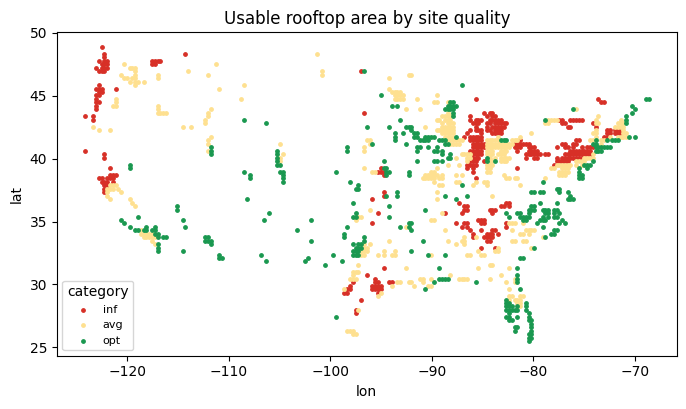
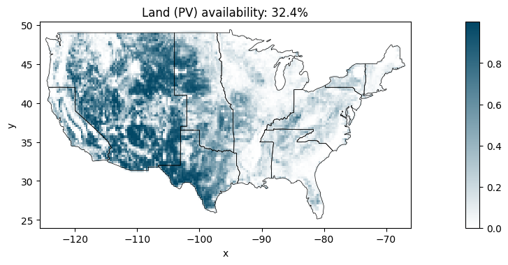
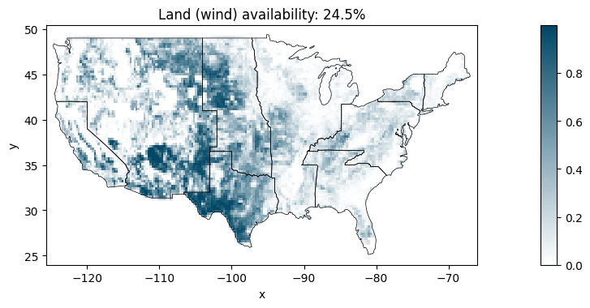
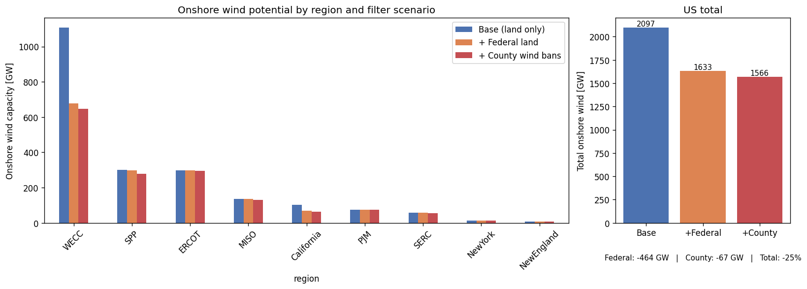

# GIS & Timeseries Tool

Generates renewable **capacity-factor timeseries** and GIS-based **renewable energy potentials** for [GENeSYS-MOD](https://github.com/GENeSYS-MOD), built on [atlite](https://atlite.readthedocs.io) and the ERA5 reanalysis dataset.

**Timeseries** (hourly, per region):

- Utility-scale PV (fixed or per-cell optimal tilt) and rooftop PV
- Onshore and offshore wind (configurable turbine models)
- Temperature, heat-pump COP (air & ground source), heating/cooling degree proxies

**GIS potentials** (installable capacity per region, from land-cover / protected-area / bathymetry exclusion analysis):

- Utility PV and onshore wind on available land
- Rooftop PV on built-up areas
- Offshore wind per water-depth class (shallow / transitional → fixed foundations, deep → floating)

The tool is **region-agnostic**: all logic lives in [functions.py](functions.py), and the notebooks are thin drivers that pass region-specific data (polygons, land-cover rasters, class codes, capacity densities) as parameters. The same code runs Germany, Europe, the US, or any region you provide data for.

  

## Example outputs

Usable onshore sites (PV / onshore wind) for the lower-48 US, categorised by site quality (`opt` / `avg` / `inf` — best / average / worst third of long-run yield):

Usable offshore wind sites in the US EEZ, classified by water depth (shallow / transitional / deep):

Usable rooftop-PV sites (built-up land-cover classes only):

Stitched land-availability maps from the exclusion analysis (share of each cell developable). Utility PV and onshore wind differ because wind gets additional exclusion layers (e.g. federal land, county wind ordinances):

Effect of stacking exclusion filters on the onshore wind potential (US example: base land exclusion → + federal land → + county wind ordinances):

## Folder layout

| Path | Contents |
|---|---|
| [functions.py](functions.py) | All logic. Edit here, not in the notebooks. |
| [GENeSYS-MOD_RES_Tool.ipynb](GENeSYS-MOD_RES_Tool.ipynb) | Reference notebook (small Germany example run). Start here. |
| `GENeSYS-MOD_RES_Tool_DE.ipynb` / `_CA.ipynb` / `_US.ipynb` | Full regional setups (Germany, Canada, US). Depend on large local `geodata/` layers that are **not** in git. |
| `geodata/` | Input layers: region polygons, land cover, protected areas, EEZ, bathymetry. Large files are git-ignored; small examples (Germany geojson/EEZ/bathymetry) are included. |
| `cutouts/` | ERA5 cutouts (`.nc`) + `era5_cache/` (raw CDS download cache). Git-ignored. |
| `solarpanel/` | PV panel configs (e.g. `CSi.yaml`, `CdTe_inv95.yaml`). |
| `windturbines/` | Turbine power-curve configs (Vestas, Siemens Gamesa, NREL reference turbines, …). |
| `output/` | Generated CSVs and figures, one subfolder per timeframe. Git-ignored. |

## Requirements

Python ≥ 3.9 with: `atlite`, `xarray`, `dask`, `geopandas`, `pandas`, `numpy`, `matplotlib`, `seaborn`, `cartopy`, `scikit-learn`, `rasterio`, `shapely`, `pyyaml`.

ERA5 data is downloaded through the Copernicus **Climate Data Store**: register at [cds.climate.copernicus.eu](https://cds.climate.copernicus.eu/) and configure your API key as described in the [CDS API docs](https://cds.climate.copernicus.eu/api-how-to).

Mind the memory: continental extents need substantial RAM (≥ 24 GB for Europe-scale cutouts). The GIS analysis has a memory-safe per-region mode for large extents (see below).

## Quickstart

Open a notebook (start with [GENeSYS-MOD_RES_Tool.ipynb](GENeSYS-MOD_RES_Tool.ipynb)) and work through it top to bottom. The flow is:

1. **Configure** — turbine/panel models, region file, offshore EEZ + bathymetry files, `timeframe`, cutout `filename`, grid resolution (`dx_step`/`dy_step`), and the run switches:
   - `generate_full_area_timeseries` — full-area capacity-factor export (slow; leave off while iterating on GIS potentials)
   - `run_GIS_analysis` — master switch for the availability analysis; when off, usable sites are loaded from a previous run (`output/coords/`)
   - `run_GIS_analysis_by_region` — memory-safe per-region loop vs. single-pass
2. **`estimate_cutout_size(...)`** — prints grid cells, time steps and data volume *before* anything is downloaded. Adjust extent/resolution if too large.
3. **`get_cutout(...)`** — downloads and prepares the ERA5 cutout. Downloads are chunk-cached in `cutouts/era5_cache/`, so an interrupted run resumes instead of re-downloading; corrupt cutouts are detected and rebuilt.
4. **`get_coords(...)`** — builds onshore/offshore coordinate sets. Offshore cells are clipped to the EEZ and classified by depth from the bathymetry grid.
5. **Timeseries** — `pv_capacity_factors`, `wind_onshore_capacity_factors`, `wind_offshore_capacity_factors`, `temperature_timeseries` (also yields heat-pump COP and heating/cooling series).
6. **GIS potentials** — build exclusion containers (`make_land_excluder`, `make_rooftop_excluder`, optional extra layers via `add_exclusion_layers`), then `calculate_potentials_per_region(...)` for the memory-safe all-region run. Offshore via `calculate_offshore_potentials(...)`.
7. **Usable-site timeseries** — filter cutout cells to developable sites (`usable_onshore_coords`, `usable_offshore_coords`) and rerun the capacity-factor functions on those, giving "usable sites only" timeseries per site-quality category.

## Two region workflows

`get_coords` auto-selects the workflow from the columns of your `geo_file`:

- **Region-geojson** (recommended): the geojson has a `region` column; results are produced per region polygon. Offshore areas come from an EEZ polygon + bathymetry grid. Used by the US (RTO/ISO regions), Canada and Germany notebooks.
- **Country/ISO**: the geojson has `iso_a2` / `iso_3166_2` columns (natural-earth admin boundaries); `admin=0` gives country level, `admin=1` states/provinces.

## Outputs

All outputs land in `output/<timeframe>/`, prefixed with the timeframe and cutout filename:

- `<year>_<region>_pv_{opt,avg,inf,horizontal}.csv` — PV capacity factors per site-quality category
- `<year>_<region>_wind_onshore_{opt,avg,inf}.csv`, `..._wind_offshore_{shallow,transitional,deep}.csv`
- `<year>_<region>_usable_*.csv` — same, restricted to developable sites (incl. `pv_rooftop`)
- `<year>_temperature_<region>.csv`, `..._heatpump_cop_...`, `..._heatpump_ground_cop_...`, `..._heating_...`, `..._cooling_...`
- `<region>_potentials_<REGION>.csv` + `<region>_potentials_combined.csv` — installable capacity (GW) per region and technology
- `<region>_potentials_offshore.csv` — offshore potential per region and depth class
- `output/coords/` — cached usable-site coordinates, reloadable in later runs (`load_usable_coords`) so the expensive GIS pass doesn't need repeating

## Adding a new region

1. Create a region geojson with a `region` column (or use country ISO codes).
2. Collect the data layers: a land-cover raster (note its class codes and CRS), protected-area files, and — for offshore — an EEZ polygon and a bathymetry grid.
3. Copy an existing notebook and swap paths, class-code lists and capacity densities. No `functions.py` change should be needed.
4. Run `estimate_cutout_size` first, and test the GIS part on a single region (`get_region_shapes(geo_file, ['<one region>'])`) before a full run.

## Performance & platform notes

- **Memory-safe GIS mode**: `calculate_potentials_per_region` processes one region at a time, so high-resolution land-cover rasters (e.g. 30 m NLCD) are only rasterized over one region's bounding box at once. Use it for anything continental; the single-pass variant can exhaust RAM.
- **Resumable downloads**: `get_cutout` caches every CDS request chunk in `cutouts/era5_cache/` keyed by request hash — interrupted or failed runs reuse cached chunks.
- **Windows + antivirus**: large cutout writes can appear to freeze at "99% Completed" while the real-time virus scan locks the multi-GB `.nc` file. Exclude the `cutouts/` folder from scanning (admin PowerShell): `Add-MpPreference -ExclusionPath "<path-to>\GIS_&_Timeseries_Tool\cutouts"`.
- **Big runs are slow**: large protected-area files and 30 m rasters take time. Iterate on one region and a short timeframe first.

## License

Apache License 2.0 — see [LICENSE.txt](../LICENSE.txt).
